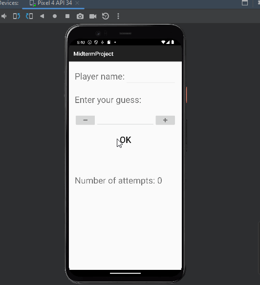

# Number Guessing Game

Guessing game where users guess a number from 1-100.

## Functionality 

The following **required** functionality is completed:

* [ ] User can play a game while being guided with toasts whether number is lower or higher than guessed.                   
* [ ] User score will be shown on main menu after the game and saved in a database.
* [ ] User can view their previous high scores and delete them.

The following **extensions** are implemented:

* Room Library
* ListAdapter
* DiffUtil
* RecyclerView
* SafeArgs
* Fragment
* NavController

## Video Walkthrough

Here's a walkthrough of the program:

GIF created with [LiceCap](http://www.cockos.com/licecap/).

## Notes

I think the hardest part of this assignment was determining if the sound was playing or if it wasn't. I spend a lot of time with 
the mediaplayer and praying the android display and audio both loaded for wrong guesses.

## License

    Copyright [2023] [Ethan DePorter]

    Licensed under the Apache License, Version 2.0 (the "License");
    you may not use this file except in compliance with the License.
    You may obtain a copy of the License at

        http://www.apache.org/licenses/LICENSE-2.0

    Unless required by applicable law or agreed to in writing, software
    distributed under the License is distributed on an "AS IS" BASIS,
    WITHOUT WARRANTIES OR CONDITIONS OF ANY KIND, either express or implied.
    See the License for the specific language governing permissions and
    limitations under the License.
